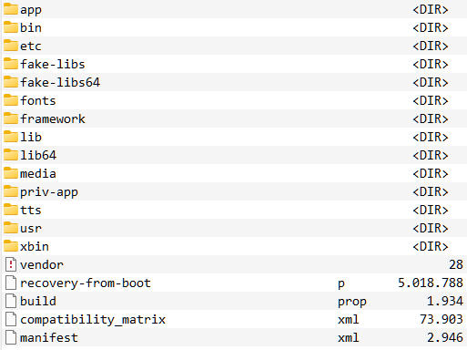

# Hacking and rooting the Ratta Supernote A5 X (and probably A6 X)

## Intro

I received the device as a gift. Whenever I receive a new device I take a quick look into it. Especially with a device that invites some rather personal or business critical data. 
Even though in this case I more or less trust the company Ratta to do the best they can to protect my data - being a (part-)Chinese company there's very little they *can* do. We all are aware of the dangerous state of privacy laws and regulations in China. Also I had reason to believe devices are being made by a third party [OEM manufacturer](http://www.htfyun.cn/) also located in mainland China.
Cloud servers apparently are located in China so entirely open to the Chinese government. Even though the company seems to currently be testing servers in the US that doesn't make me any less careful.

After looking into the device I could not find anything obviously compromising. Some of the Ratta Apps come with partly obfuscated Tencent components embedded. The device seems to be respecting your telemetry settings (take note Google, Apple, et al) but is very regularly checking for updates which at least might be tracking you in terms of location and usage patterns.  

**I do not advice anyone to follow this writeup in practice as you will very likely brick your device.**

**Most of this is written down from memory. Which in my case isn't very reliable. So there might be errors or omissions that increase your risk of rendering your device unusable along with voiding your guarantee.**

## Reason for disclosure

See above. Given physical access this device can not be considered secure for any highly sensitive data. Also since Ratta promised to allow sideloading anyways as well as seeing the device coming wide open with a preinstalled su binary, test keys, open boot loader, (disabled) adb interface and other open doors I assume this will not create any unexpected inconvenience.

## GIVE ME FILES!!!!!

Nope. **Under no circumstances I will distribute any files that might even remotely be covered by copyright or such.** If you know what you're doing this writeup contains more than enough information. If not, please leave your device as is and ask Ratta for shell / root access to your device.

## Technical data

You can find a limited amount of device specifications by installing the kindle app which is - as of the time of writing - the only available app on the integrated "app store" of the device. Or you just unpack an OTA update.zip.

The device runs Android 8.1 on a Rockchip PX30 platform consisting of a 1,5GHz quad core ARM Cortex-A35, 2 gigs of RAM and a 1404x1872 eink display. The Rockchip platform seems to often be found in car radios and other embedded devices that come with a user interface. So you can find a lot of official and less official info on it by just googling.

Like so: [rockchip.fr/PX30%20datasheet%20V1.1.pdf](https://rockchip.fr/PX30%20datasheet%20V1.1.pdf)
Or so: [opensource.rock-chips.com/wiki_Main_Page](http://opensource.rock-chips.com/wiki_Main_Page)

## Collecting information

Deducting from the fact that there's a [/r/supernote](https://www.reddit.com/r/Supernote/) and a [/r/supernote_beta](https://www.reddit.com/r/Supernote_beta/) on reddit a beta program exists for the device. 

Ratta offers information on both release an beta updates there as well as on their website:

- [support.supernote.com/category/1/system-update](https://support.supernote.com/category/1/system-update)
- [support.supernote.com/article/2/release-notes-for-a5-x-and-a6-x](https://support.supernote.com/article/2/release-notes-for-a5-x-and-a6-x)

The current non-beta can be downloaded from here:
[support.supernote.com/article/3/how-to-update-your-supernote](https://support.supernote.com/article/3/how-to-update-your-supernote)

The beta can not as it's distribution is tied to the serial number of your device as can be found in the `SupernoteSettings.apk`, since independently of the version currently installed, it connects to the same server and URL. See below for more in depth info.

Updates are common, non encrypted Android OTA files which can easily be unpacked and analysed using freely available tools. See below for more info.

> update.zip with unpacked .br brotli images:

> update.zip:/system

## Update mechanism

### Update checks

The device updates by coordinating with a server at `device.supernote.com.cn` to see whether there is a new update available:

	curl -X POST -k -H 'Content-Type: application/json' -i 'https://device.supernote.com/official/system/business/android/update/download' --data '{"language":"EN", "equipmentNo":"SN100Bxxxxxxxx", "logicVersion":"Chauvet 2.4.15(566)", "configureList":[{"type":"1", "version":"Chauvet.D002.2203101001.566_release"}]}'

Error messages are in chinese but are the usual *Device doesn't need an update*, *Serial number unknown*, etc.

If an update is available the device receives a download URL along with a full changelog etc.

> {"success":true,"errorCode":null,"errorMsg":null,"configureList":[{"type":"1","version":"Chauvet.xxxx.xxxxxxxxxx.xxx_xxxxxxx","fileName":"Chauvet.xxxx.xxxxxxxxxx.xxx_xxxxxxx.zip","name":null,"packageName":null,"versionNo":null,"url":"https://prod-ratta-firmware.s3.ap-northeast-1.amazonaws.com/xxxxxx/update.zip","size":xxxxxxxx,"md5":"abcdefabcdefabcdefabcdef"}],"totalSize":xxxxxxxx,"fixPointList":[{"current":false,"version":"Chauvet x.x.xx(xxx)","fixPoint":"
...
","opTime":"xxxx-xx-xx xx:xx:xx"}],"logicVersion":" Chauvet x.x.xx(xxx)","deployDate":"xxxx-xx-xx xx:xx:xx"}

### Update installation

Which is then being downloaded and handed over to the recovery system.

Same happens if you follow the manual update instructions by putting an update.zip file in the `/EXPORT/` folder on your device and pull the USB cable. The device discovers the file and asks you if it should go ahead installing.

The exact mechanism can be deducted from the following code.

> com.ratta.supernote.update.NetWorkConstant

    public static final String DEV_BASE_URL = "http://10.20.22.32:9000";
    public static final String DOWN_LOAD_URL = "";
    public static final String NET_BASE_URL_PRODUCT = "http://10.20.22.32:8075/";
    public static final String NET_BASE_URL_TEST = "https://test-ms-device.ratta.com.cn/";
    public static final String RELEASE_BASE_URL = "https://device.supernote.com.cn/";
    public static final String UAT_BASE_URL = "https://device.supernote.com";
    public static final File DOWN_LOAD_PATH = new File("/cache");
    public static final String USBDisk_Path = Environment.getExternalStorageDirectory() + File.separator;
    public static final String FILE_TEST = USBDisk_Path + "EXPORT/test";
    public static final String FILE_PRODUCT = USBDisk_Path + "EXPORT/product";
    public static final String FILE_UAT = USBDisk_Path + "EXPORT/uat";

> com.ratta.networklibrary.utils.C0598Utils

    String str = Build.DISPLAY; // i.E. Chauvet.D002.2203101001.566_release
    boolean exists = new File(Constant.FILE_USA).exists();
    int lastIndexOf = str.lastIndexOf("_");
    if (lastIndexOf != -1) {
        String substring = str.substring(lastIndexOf + 1);
        String str2 = ((TextUtils.equals(substring, "root") || TextUtils.equals(substring, "hard")) && exists) ? Constant.USA_BASE_URL : Constant.RELEASE_BASE_URL;
        if (new File(Constant.FILE_TEST).exists() || TextUtils.equals(substring, "test")) {
            str2 = exists ? Constant.TEST_USA_BASE_URL : Constant.TEST_BASE_URL;
        } else if (new File(Constant.FILE_PRODUCT).exists()) {
            str2 = Constant.DEV_BASE_URL;
        } else if (new File(Constant.FILE_UAT).exists() || TextUtils.equals(substring, "uat")) {
            str2 = Constant.UAT_BASE_URL;
        }
        if (!TextUtils.equals(substring, "release") && !TextUtils.equals(substring, "beta")) {
            return str2;
        }
        if (exists) {
            return Constant.USA_BASE_URL;
        }
    }
    return Constant.RELEASE_BASE_URL;

> com.ratta.supernote.update.DownLoadService

    @POST("official/system/business/android/update/download")
    Call<DownResponse> downLoadFileInfo(@Body RequestBody requestBody);

> com.ratta.supernote.update.UpDateAppService

    LocalSystemInfoBean localSystemInfoBean = new LocalSystemInfoBean(); // see CURL request above for example values
    localSystemInfoBean.setEquipmentNo(DownPresenter.getDeviceVersion());
    localSystemInfoBean.setLanguage(DownPresenter.getLanguage(this));
    localSystemInfoBean.setLogicVersion(DownPresenter.getLogicVersion());
    localSystemInfoBean.setConfigureList(DownPresenter.getSystemAllPackageVersion(this, new ArrayList()));
    RetrofitUtils retrofitUtils = RetrofitUtils.getInstance();
    final DownResponse downResponse = (DownResponse) retrofitUtils.execute(((DownLoadService) retrofitUtils.getService(DownLoadService.class)).downLoadFileInfo(DownLoadModel.getRequestBody(localSystemInfoBean)));

> com.ratta.supernote.update.UpDateAppService

    if (new File(NetWorkConstant.DOWN_LOAD_PATH, "update.zip").exists()) {
        CacheInfoUtils.saveData(CacheInfoUtils.updateFlagPath, UpDateAppService.USB_UPDATE_FLAG);
        RecoverySystem.installPackage(UpDateAppService.this, new File(NetWorkConstant.DOWN_LOAD_PATH, "update.zip")); // if unfamiliar: https://developer.android.com/reference/android/os/RecoverySystem
    }

> com.ratta.supernote.update.UpDateAppService

    private void checkRestartUpdate() {
        String str = SystemProperties.get(ConstanceUtil.restartKey, Constance.FILE_SEVER_UFILE);  // FILE_SEVER_UFILE = "0"; restartKey = "ratta.launcher.restart";
        LogUtils.m187d("ratta: " + str);
        if (!str.equals("1")) {
            SystemProperties.set(ConstanceUtil.restartKey, "1");
            this.firstSelectVersion = true;
            if (new File(Environment.getExternalStorageDirectory().getAbsolutePath() + File.separator + "EXPORT", "update.zip").exists()) {
                this.firstSelectVersion = false;
                usbUpdate();
                return;
            }
            LogUtils.m187d("checkRestartUpdate: getVersionList");
            getVersionList();
        }
    }

    public void usbUpdate() {
        if (this.usbUpdateFlag) {
            return;
        }
        final File file = new File(Environment.getExternalStorageDirectory().getAbsolutePath() + File.separator + "EXPORT", "update.zip");
        if (!file.exists()) {
            LogUtils.m187d("onReceive: No USB upgrade file");
            return;
        }
        GestureService.lockStatusbar = true;
        GestureService.lockSlidebar = true;
        this.usbUpdateFlag = true;
        LogUtils.m187d("usb update GestureService.lockStatusbar true");
        DialogUtils.getInstance().build(this).createDefaultDelayDialog(getString(C0688R.string.usb_detection_tips), 30, new LibDialogDelayDefaultListener() {  // "The upgrade pack is detected, do you want to install?"
        // goes on with housekeeping like removing any existing update.zip and a couple of checks for enough battery etc and then moves the update.zip to /cache as seen above

As you can see there are no sanity checks or any type of decryption going on. So you can basically take any file, move it to the /EXPORT/ folder and let the system hand it over to recovery.

I never checked but reading the code I assume you can up- and downgrade your device at will over USB.

Though since it's the standard Android recovery mechanism (which I am not super familiar with) it will check whether the file is signed with a known private key.

This definitely caught my attention.

## Cracking open the device *(not physically)*

When I looked at the `/system/build.prop` I found 

	ro.build.description=px30_ht_eink-userdebug 8.1.0 OPM8.190505.001 Chauvet.D002.2206171001.629_beta test-keys
	ro.build.fingerprint=Android/htfy_px30:/Chauvet.D002.2206171001.629_beta_:userdebug

`test-keys` is not a very good sign. If you're the developer. It's a beautiful sign if you're looking for a wide open door into the system.

I'm not going into the details of Android OTA but you can read about it [here](https://source.android.com/devices/tech/ota).

By looking at update.zip: `/META-INF/com/android/otacert` we can look at the public cert for the update:

> -----BEGIN CERTIFICATE----- 
> MIID+zCCAuOgAwIBAgIJAJKlKMdz16FBMA0GCSqGSIb3DQEBCwUAMIGUMQswCQYD 
> VQQGEwJVUzETMBEGA1UECAwKQ2FsaWZvcm5pYTEWMBQGA1UEBwwNTW91bnRhaW4g 
> VmlldzEQMA4GA1UECgwHQW5kcm9pZDEQMA4GA1UECwwHQW5kcm9pZDEQMA4GA1UE 
> AwwHQW5kcm9pZDEiMCAGCSqGSIb3DQEJARYTYW5kcm9pZEBhbmRyb2lkLmNvbTAe 
> Fw0xNDEyMjMwNjQ0MDhaFw00MjA1MTAwNjQ0MDhaMIGUMQswCQYDVQQGEwJVUzET 
> MBEGA1UECAwKQ2FsaWZvcm5pYTEWMBQGA1UEBwwNTW91bnRhaW4gVmlldzEQMA4G 
> A1UECgwHQW5kcm9pZDEQMA4GA1UECwwHQW5kcm9pZDEQMA4GA1UEAwwHQW5kcm9p 
> ZDEiMCAGCSqGSIb3DQEJARYTYW5kcm9pZEBhbmRyb2lkLmNvbTCCASAwDQYJKoZI 
> hvcNAQEBBQADggENADCCAQgCggEBALl71fjESroAzdrkBKrApCrK9qnZfH38S3U3 
> 6jhBOQtrwxnh/AaRC3hOyO5ihjwv1MlSuTA1DygGMznwP8rOQbc9eH4uqdnerE87 
> v0bc8lPCj22AAterZBZESqgfRwND/25S6A22wA/kpR/CiXMuWHlQfS6Q9CHBOwVQ 
> 5ZZUge2KC1TbH8EtDkxDacOeTbhN6UQxxm3jgaIzkwyrEEcYB1m93CrTFOtVV7Jw 
> wo7XE5LGwo6nTzNieXJqoYxcNAMpv9seKW+GZ1EGl78e9B37SMoxq0I7HuStz5tD 
> tS2Er2YrjQig+1ZqgroIvPfEJAEyoEr0r6kK7jBh878usWOuWB0CAQOjUDBOMB0G 
> A1UdDgQWBBTV37ltjIiA28uNs8Z1hb6zasy5UzAfBgNVHSMEGDAWgBTV37ltjIiA 
> 28uNs8Z1hb6zasy5UzAMBgNVHRMEBTADAQH/MA0GCSqGSIb3DQEBCwUAA4IBAQAZ 
> 7pvK3yDr+O0G8ggDfaISkEeg0agocRcXGT/MRiPBz+n45+bEoym4hC2SdCxvHXES 
> 5AHkFxjWavoQqAD8We955NCmpGzDip4hUctlXzqxYfSTvGiLArG92+Hcbu5RNx/7 
> o3Of39Mdge2jVKQuKAALWnb8TgJ/2k3KAUFzVqMXPY4asmnWtyW2FIKLdZU/yYTX 
> +8Tp0AhP+N84HUGg5BwQRD10/OGGY54rLfFy2aSLPxUZQ+VTSZB9Z9XRLxohsF/V 
> XBcZyCdPP254wDYL5R0HGWZv7CeBlVjw3FqDRI9aljdYfLpAk+clnRBwWOWHsiOE 
> pJXgkkLmpq0uDXsSMJZ2 
> -----END CERTIFICATE-----

### Finding the private key to sign OTAs

[Googling part of the cert](https://www.google.com/search?q=%22pJXgkkLmpq0uDXsSMJZ2%22) yields at least one result from xda-developers.com where someone is trying to get into their Android 8.1 Rockchip PX5 device.

That's an even worse sign. Or an even more beautiful one for me.

Next I googled for an SDK around the PX30 platform and found one here:

[en.t-firefly.com/doc/download/page/id/63.html#other_206](https://en.t-firefly.com/doc/download/page/id/63.html#other_206)

along with docs here:

[wiki.t-firefly.com/en/Core-PX30-JD4/Android_development.html](https://wiki.t-firefly.com/en/Core-PX30-JD4/Android_development.html)

and here:

[wiki.t-firefly.com/en/Firefly-RK3399/customize_android_firmware.html](https://wiki.t-firefly.com/en/Firefly-RK3399/customize_android_firmware.html)

Downloading the SDK you can unpack the 7z archive and init the contained git repo through:

    git clone PX30_Android8.1.0_LVDS_190706 directory_to_clone_into

After a lengthy clone find the SDKs test keys under `/build/make/target/product/security` and you're good to go.

Fun fact: README in that folder states:

> The test keys in this directory are used in development only and should
> NEVER be used to sign packages in publicly released images (as that would
> open a major security hole).

Yup, confirmed.

### Build and sign your own update.zip

I leave the technique up to you - while working on Windows I use [Multi Image Kitchen](https://forum.xda-developers.com/t/kitchen-windows-multi-image-kitchen-repack-android-partitions.4326387/) to unpack and repack and sign Android OTAs. You will have to move your 
`testkey.x509.pem` and `testkey.pk8` into the `\bin` folder of the tool and from there on will be able to create modified updates the device will have no choice but installing when you place it in the EXPORT folder.

## YOU WILL NOW BRICK YOUR DEVICE!

Well, probably. 

All you do from here is extremely prone to error and to soft bricking your device. As far as I know all Rockchip devices can never be entirely soft bricked since they always come with a maskrom mode which basically is an open programming interface. 

Usually this interface can be accessed through shorting two pins on the CPU. This works on your Supernote as well but involves opening the device and most probably voiding any remaining guarantee you might have. 

**See [below](#maskrom-in-case-stuff-breaks) for all info about PX30 maskrom and how to recover your device.**

#### Back up your partitions

Backup all partitions for example by issuing these commands in a root adb shell:

	adb shell

	cat /dev/block/mmcblk1p1 > /sdcard/EXPORT/uboot.img
	cat /dev/block/mmcblk1p2 > /sdcard/EXPORT/trust.img
	cat /dev/block/mmcblk1p3 > /sdcard/EXPORT/misc.img
	cat /dev/block/mmcblk1p4 > /sdcard/EXPORT/resource.img
	cat /dev/block/mmcblk1p5 > /sdcard/EXPORT/kernel.img
	cat /dev/block/mmcblk1p6 > /sdcard/EXPORT/boot.img
	cat /dev/block/mmcblk1p7 > /sdcard/EXPORT/recovery.img
	cat /dev/block/mmcblk1p8 > /sdcard/EXPORT/backup.img
	cat /dev/block/mmcblk1p9 > /sdcard/EXPORT/security.img
	cat /dev/block/mmcblk1p10 > /sdcard/EXPORT/cache.img
	cat /dev/block/mmcblk1p11 > /sdcard/EXPORT/system.img
	cat /dev/block/mmcblk1p12 > /sdcard/EXPORT/metadata.img
	cat /dev/block/mmcblk1p13 > /sdcard/EXPORT/vendor.img
	cat /dev/block/mmcblk1p14 > /sdcard/EXPORT/oem.img
	cat /dev/block/mmcblk1p15 > /sdcard/EXPORT/frp.img

### Supernote A5X partition layout:

### blocks by-name:

    backup -> /dev/block/mmcblk1p8
    boot -> /dev/block/mmcblk1p6
    cache -> /dev/block/mmcblk1p10
    frp -> /dev/block/mmcblk1p15
    kernel -> /dev/block/mmcblk1p5
    metadata -> /dev/block/mmcblk1p12
    misc -> /dev/block/mmcblk1p3
    oem -> /dev/block/mmcblk1p14
    recovery -> /dev/block/mmcblk1p7
    resource -> /dev/block/mmcblk1p4
    security -> /dev/block/mmcblk1p9
    system -> /dev/block/mmcblk1p11
    trust -> /dev/block/mmcblk1p2
    uboot -> /dev/block/mmcblk1p1
    userdata -> /dev/block/mmcblk1p16
    vendor -> /dev/block/mmcblk1p13

### relevant mounts:

    rootfs / rootfs ro,seclabel,size=981980k,nr_inodes=245495 0 0
    /dev/block/by-name/system /system ext4 ro,seclabel,relatime,data=ordered,inode_readahead_blks=8 0 0
    /dev/block/by-name/vendor /vendor ext4 ro,seclabel,relatime,data=ordered,inode_readahead_blks=8 0 0
    /dev/block/by-name/oem /oem ext4 ro,seclabel,noatime,nodiratime,block_validity,delalloc,barrier,noauto_da_alloc,user_xattr 0 0
    /dev/block/by-name/cache /cache ext4 rw,seclabel,nosuid,nodev,noatime,nodiratime,discard,noauto_da_alloc,data=ordered 0 0
    /dev/block/by-name/metadata /metadata ext4 rw,seclabel,nosuid,nodev,noatime,nodiratime,discard,noauto_da_alloc,data=ordered 0 0
    /dev/block/by-name/userdata /data f2fs rw,lazytime,seclabel,nosuid,nodev,noatime,nodiratime,background_gc=on,discard,no_heap,user_xattr,inline_xattr,inline_data,inline_dentry,flush_merge,extent_cache,mode=adaptive,active_logs=6,alloc_mode=default,fsync_mode=posix 0 0
    tmpfs /storage tmpfs rw,seclabel,relatime,mode=755,gid=1000 0 0
    adb /dev/usb-ffs/adb functionfs rw,relatime 0 0
    /data/media /mnt/runtime/default/emulated sdcardfs rw,nosuid,nodev,noexec,noatime,fsuid=1023,fsgid=1023,gid=1015,multiuser,mask=6,derive_gid 0 0
    /data/media /storage/emulated sdcardfs rw,nosuid,nodev,noexec,noatime,fsuid=1023,fsgid=1023,gid=1015,multiuser,mask=6,derive_gid 0 0
    /data/media /mnt/runtime/read/emulated sdcardfs rw,nosuid,nodev,noexec,noatime,fsuid=1023,fsgid=1023,gid=9997,multiuser,mask=23,derive_gid 0 0
    /data/media /mnt/runtime/write/emulated sdcardfs rw,nosuid,nodev,noexec,noatime,fsuid=1023,fsgid=1023,gid=9997,multiuser,mask=7,derive_gid 0 0

## Rooting the device

The update that was on my device already came with a su binary and lots of shortcuts that gave me easy access to a root adb interface.

### Enabling root adb interface

Some modifications I experimented with were:

> /system/etc/prop.default

	security.perf_harden=0
	ro.debuggable=1
	sys.rkadb.root=1
	ro.debug.build=true
	ro.oem_unlock_supported=1
	ro.secure=0
	ro.adb.secure=0
	persist.sys.usb.config=mtp,adb

### Disable auto update and telemetry

And while there I blocked the very frequent update checks and optional telemetry (also blocks the built-in App Store but that's pretty much useless as we can now sideload apps to the device)

> /system/etc/hosts

	127.0.0.1       device.supernote.com.cn
	127.0.0.1       supernote.com.cn
	127.0.0.1       www.supernote.com.cn
	127.0.0.1       device.supernote.com
	127.0.0.1       supernote.com
	127.0.0.1       www.supernote.com
	127.0.0.1       test-ms-device.ratta.com.cn
	127.0.0.1       uat-ms-device.ratta.com.cn
	127.0.0.1       ratta.com.cn

You have a working root adb interface from here, can sideload apps and fully modify the /system to your liking after issuing a `mount -o remount,rw /system` 

### SuperSU to make a broken root a bit less broken

First step I then made then was installing a properly working SuperSU system-based root solution. For that I downloaded the latest supersu.zip, unpacked it, looked at the install script and put files in place manually in a super hacky way:

	/system/.ext/.su   # useless I think? Didn't bother to understand
	/system/xbin/daemonsu
	/system/xbin/su
	/system/xbin/sugote
	/system/xbin/sugote-mksh
	/system/xbin/supolicy
	/system/lib64/libsupol.so
	/system/app/SuperSU/SuperSU.apk

And modify `/system/bin/install-recovery.sh` to end in:

	/system/xbin/daemonsu --auto-daemon &
	/system/etc/install-recovery-2.sh

Then modifying file contexts and access rights by modifying `system_file_contexts.txt` to end in:

	/system/app/SuperSU/SuperSU.apk u:object_r:system_file:s0
	/system/xbin/su u:object_r:system_file:s0
	/system/bin/.ext/.su u:object_r:system_file:s0
	/system/xbin/daemonsu u:object_r:system_file:s0
	/system/xbin/sugote u:object_r:zygote_exec:s0
	/system/xbin/supolicy u:object_r:system_file:s0
	/system/lib64/libsupol.so u:object_r:system_file:s0
	/system/xbin/sugote-mksh u:object_r:system_file:s0

and `system_fs_config.txt` to end in:

	system/app/SuperSU 0 0 0755
	system/app/SuperSU/SuperSU.apk 0 0 0644
	system/xbin/su 0 2000 0755
	system/bin/.ext 0 2000 0755
	system/bin/.ext/.su 0 2000 0755
	system/xbin/daemonsu 0 2000 0755
	system/xbin/sugote 0 2000 0755
	system/xbin/supolicy 0 2000 0755
	system/lib64/libsupol.so 0 0 0644
	system/xbin/sugote-mksh 0 2000 0755

Worked perfectly fine.

It would have been simple to implement a quick script but at this point I was just getting into Android root and my plan was to install a proper magisk systemless root.

## Installing systemless root through Magisk

Magisk can produce pre modified "rooted" boot.img kernel and ramdisk by feeding it the unmodified boot.img.

### Preparation

Take the `boot.img` from the root of your `update.zip` and copy it to `/storage/emulated/0/Download`

Sideload [latest Magisk](https://github.com/topjohnwu/Magisk/releases) like so:

`adb install Magisk-v25.x.apk`

On the device go to `Settings > Apps > My apps` to make the system refresh the list of apps and have it add Magisk to the sidebar. You might have to scroll there to find it, since the launcher UI clearly isn't made for people with many apps.

Before being able to choose a file to patch in Magisk I needed to install a DocumentProvider which I chose to be [Total Commander](https://www.ghisler.ch/board/viewforum.php?f=22) ([download](https://www.ghisler.com/tcandroid3.apk)) as it's free and super handy. Sideloaded that:

`adb install tcandroidxxxx-universal.apk`

Do the same as above to make it appear in the sidebar. Open it and blindly tap on the top right to open an "empty" menu where you try to tap the second last item to switch from the dark theme to the light one in order to finally see everything properly.

### Patching boot.img

Open Magisk, (grant it root access), tap Update, leave everything as is, tap next, "Select and Patch a file", choose Total Commander (url...) as provider and then select your boot.img.

Again copy the resulting `magisk_patched-xxx.img` from it's default work folder `/storage/emulated/0/Download` back to your computer.

### Installing magisk through fastboot

From boot your device into fastboot:

`adb reboot fastboot`

and issue the standard:

`fastboot flash boot magisk_patched-xxx.img`

and 

`fastboot reboot`

If all went well, your device will boot into system, you can open magisk and it will report the version installed along with *Ramdisk: yes*. If you previously installed SuperSU or haven't removed the pre-installed su binary it will warn you of a corrupted installation and ask you to remove any previous root. You do that by removing all the files you added or just the pre installed `su` and `libsupol.so`

Open any app that requests Superuser to make sure things are working properly and be greeted by the familiar Superuser prompt:

## Other info

I assembled a [list of previous firmware files going back to v1.0.1(077)](supernote-updates.md "List of Supernote A5X Updates").

To be completed once I have time.

## Maskrom in case stuff breaks

In case anything happens to your device, open it, remove the shielding from the CPU, short the following two pin headers while pressing the reset switch next to power switch.

This will put your device in maskrom mode. I will not go into all detail on how to recover the device exactly but will leave you the most relevant info as well as the advice to make backups of all your partitions before doing ANY modifications to your device.

### Prerequisites

Next install [maskrom drivers](https://rootmydevice.com/download-rockchip-driver-assistant/) (Make sure to [enable unsigned drivers](https://support.viewsonic.com/en/support/solutions/articles/33000252416-how-to-install-unsigned-drivers-in-windows-10) in windows then use tools like `RKImageMaker` and `AFPTool` to create an update.img that can be flashed through [RKDevTool](https://drive.google.com/file/d/1HV1tZVxYf7rCg1mK5iLDYdqt0UGnWNpX/view) (from [here](https://en.t-firefly.com/doc/download/140.html)) in maskrom. RKDevTool contains the aforementioned two binaries you need to create the update package.

RKDevTool by default comes in chinese language and with more or less useless validation checks of your firmware which you can turn off by using it's .ini:

    [Language]
    Selected=2

and

    FW_NOT_CHECK=TRUE
    RB_CHECK_OFF=TRUE
    CHECK_MACHINE_MODEL=FALSE

All in all figuring out the process was a fun experience since the Rockchip SDK and tooling landscape is extremely fragmented.

### update.img

These files will be needed for a complete update.img. You can source them from places like the partition backups you made and in parts from the abovementioned SDK or googling.

### .img.krnl vs. .img

The krnl files are there since I created a toolchain that uses a tool called [imgRePackerRK](https://forum.xda-developers.com/t/tool-imgrepackerrk-rockchips-firmware-images-unpacker-packer.2257331/) ([download](https://1drv.ms/u/s!ApT2PdXy7niKgwDS0fmgFnkJGGvB)) to convert raw .img files into the Rockchip compatible format (.img.krnl).

The tool is apparently made to replace RKImageMaker and AFPTool and be a all in one solution to create Rockchip update.img. But it wouldn't produce consistent results for me.

But it converts kernel, boot and recovery images that are compatible with Rockchip recovery.

> Image\boot.img.krnl vs. Image\boot.img

So I use it to create the .krnl files conveniently and then run my toolchain.bat to build a working update.img while keeping the original .img files along with the .krnl files.

### Example toolchain

    move Image\boot.img Image\boot.img.tmp
    move Image\recovery.img Image\recovery.img.tmp
    move Image\kernel.img Image\kernel.img.tmp
    move Image\boot.img.krnl Image\boot.img
    move Image\recovery.img.krnl Image\recovery.img
    move Image\kernel.img.krnl Image\kernel.img
    copy Image\parameter.txt .\parameter
    Afptool -pack ./ Image\tmp-update.img
    RKImageMaker.exe -RKPX30 Image\MiniLoaderAll.bin  Image\tmp-update.img update.img -os_type:androidos
    move Image\boot.img Image\boot.img.krnl
    move Image\recovery.img Image\recovery.img.krnl
    move Image\kernel.img Image\kernel.img.krnl
    move Image\boot.img.tmp Image\boot.img
    move Image\recovery.img.tmp Image\recovery.img
    move Image\kernel.img.tmp Image\kernel.img
    del Image\tmp-update.img
    pause 

### Further resources

To help you along the way here's also a compatible `/Image/parameter.txt`:

    FIRMWARE_VER:8.1.0
    MACHINE_MODEL:RK3326
    MACHINE_ID:007
    MANUFACTURER: RK3326
    MAGIC: 0x5041524B
    ATAG: 0x00200800
    MACHINE: 3326
    CHECK_MASK: 0x80
    PWR_HLD: 0,0,A,0,1
    TYPE: GPT
    CMDLINE:mtdparts=rk29xxnand:0x00002000@0x00004000(uboot),0x00002000@0x00006000(trust),0x00002000@0x00009000(misc),0x00008000@0x0000b000(resource),0x00010000@0x00013000(kernel),0x00010000@0x00023000(boot),0x00020000@0x00033000(recovery),0x00038000@0x00053000(backup),0x00002000@0x0008b000(security),0x00400000@0x0008d000(cache),0x00800000@0x0048d000(system),0x00008000@0x00C8d000(metadata),0x000C0000@0x00C95000(vendor),0x00040000@0x00D55000(oem),0x00000400@0x00D95000(frp),-@0x00D95400(userdata:grow)

As well as the `/package-file`

    package-file    package-file
    bootloader  Image/MiniLoaderAll.bin
    parameter   Image/parameter.txt
    trust       Image/trust.img
    uboot   Image/uboot.img
    misc    Image/misc.img
    resource    Image/resource.img
    kernel  Image/kernel.img
    boot    Image/boot.img
    recovery    Image/recovery.img
    security    Image/security.img
    system  Image/system.img
    metadata    Image/metadata.img
    vendor  Image/vendor.img
    oem Image/oem.img
    frp Image/frp.img
    # baseparamer  Image/baseparamer.img
    # ҪдÈëbackup·ÖÇøµÄÎļþ¾ÍÊÇ×ÔÉí£¨update.img£©
    # SELF Êǹؼü×Ö£¬±íʾÉý¼¶Îļþ£¨update.img£©×ÔÉí
    # ÔÚÉú³ÉÉý¼¶Îļþʱ£¬²»¼ÓÈëSELFÎļþµÄÄÚÈÝ£¬µ«ÔÚÍ·²¿ÐÅÏ¢ÖÐÓмǼ
    # ÔÚ½â°üÉý¼¶Îļþʱ£¬²»½â°üSELFÎļþµÄÄÚÈÝ¡£
    # RESERVED²»´ò°übackup
    backup  RESERVED
    update-script   update-script
    recover-script  recover-script

Not bother to check whether following scripts are needed but I included them for good measure.

### Misc.img

Make sure to check your misc.img as it directs recovery what to do when updating. In my case I used a blank one that does nothing. Others for example will wipe userdata making you will lose your data.

> wipe misc.img

> blank misc.img

### Recover and update scripts

`/recover-script`

    #!enable_script
    # ÔÚÐÞ¸´Ê±ÏÔʾÌáʾÐÅÏ¢
    print "Please KEEP your USB cable or DC-in connected\n"

    # »¹Ô­system
    write_image PACKAGE:system SYSTEM:
    check_image PACKAGE:system SYSTEM:

    # ¸ñʽ»¯Êý¾Ý·ÖÇø
    format CACHE:
    format DATA:
    format PAGECACHE:
    format SWAP:

`update-script`

    #!enable_script
    # ÔÚÉý¼¶Ê±ÏÔʾÌáʾÐÅÏ¢
    print "\nPlease KEEP your USB cable or DC-in connected\n"
    print "Do NOT remove SD card form the device\n\n"

    # Éý¼¶kernel
    write_image PACKAGE:kernel KERNEL:
    check_image PACKAGE:kernel KERNEL:

    # Éý¼¶boot
    write_image PACKAGE:boot BOOT:
    check_image PACKAGE:boot BOOT:

    # Éý¼¶recovery
    write_image PACKAGE:recovery RECOVERY:
    check_image PACKAGE:recovery RECOVERY:

    # Éý¼¶system
    write_image PACKAGE:system SYSTEM:
    check_image PACKAGE:system SYSTEM:

    # Éý¼¶backup
    write_image PACKAGE:backup BACKUP:
    check_image PACKAGE:backup BACKUP:

    # Éý¼¶parameter
    write_image PACKAGE:parameter PARAMETER:
    check_image PACKAGE:parameter PARAMETER:

    # ¸ñʽ»¯Êý¾Ý·ÖÇø
    format DATA:
    format CACHE:

    # дÈëÃüÁÔÚbootloaderÆô¶¯Ê±Éý¼¶bootloader
    write_blcmd update-bootloader

    # ½«bootloader´æ·Åµ½MISC·ÖÇø
    write_loader PACKAGE:bootloader MISC: 0xC000

    # ɾ³ýÉý¼¶°ü
    delete PACKAGE:
