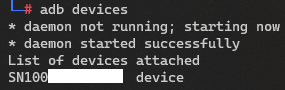
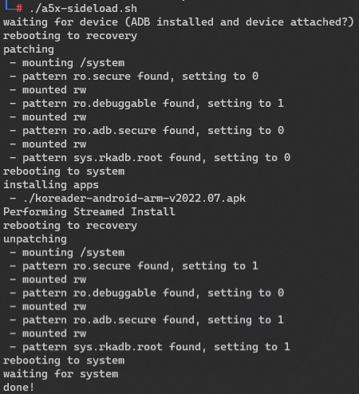
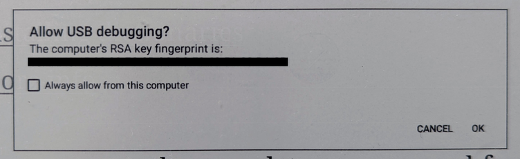

# Sideloading Apps on the Supernote A5X (and probably A6X)

## Instructions

### Is this safe?
Short: In theory yes, but depends on your environment and usage.

Long: This boots your device into recovery where it uses adb shell to modify a configuration file to open up a root shell to your device on next normal boot. It then reboots, sideloads the apps, reboots again and reverts its changes. Nothing obvious can go wrong but depending on the apps you install, the way you use them or any bugs I might be overlooking your device could - worst case - softbrick. Hardbricking the device through software is impossible to my knowledge. See my [in depth analysis here](readme.md).

### Compatibility
This has been tested on a Supernote A5X running version 2.5.17 under Windows 11 and Debian Linux.

### Prerequisite
On your Supernote remove your screen lock as it creates timing issues for the script. I couldn't be bothered to work around them. Disable it in the settings and re-enable it after the script has run.

- **Windows:** 
    - ADB: Install the [Android Platform Tools for Windows](https://dl.google.com/android/repository/platform-tools-latest-windows.zip) or use a package like [this one](https://github.com/K3V1991/ADB-and-FastbootPlusPlus/releases). If you use Platform Tools you will have to either put the files into path. You'll find plenty instruction on how to set up ADB on Google, like [here](https://www.minitool.com/news/adb-install-windows-10-mac.html). Either way you'll have to restart or at least sign out, sign into Windows again. You should then be able to connect your Supernote by USB, open a command line prompt, type adb devices and see your device in the list.
    - ADB drivers: [see here](https://www.droidthunder.com/adb-drivers/)

- **Linux:** 
    - ADB: you will most probably be able to install and setup adb through apt or similar. Otherwise please consult Google ;)
    - Bash

- **Mac:** 
    - you might be able to use the linux .sh file on Mac as well. I might try and update here in the future.

Either way, you should be able to open a terminal / command line prompt, type `adb devices` and see your device in the list.

### Instructions
- Download the script for either [Linux](https://raw.githubusercontent.com/TA1312/supernote-a5x/master/scripts/a5x-sideload.sh) (make sure to chmod u+x the script or run it through bash) or [Windows](https://raw.githubusercontent.com/TA1312/supernote-a5x/master/scripts/a5x-sideload.bat) (open in your browser and press Ctrl+S to save file or select Save as)
- Put all the apps you want to sideload into the same folder as your script
    - You can download apps as APK files from sites like ApkPure or ApkMirror or preferably use [F-Droid](https://f-droid.org/)

- Windows 
    - open a command prompt for example by pressing Win+X and choosing Command Prompt/Windows Terminal (depending on your version of Windows) and change to the folder where you put your script. Or just open that folder in Windows Explorer, right click and select Terminal or Command Prompt. Please Google otherwise.
    - run the script by typing `./a5x-sideload.bat`

- Linux 
    - open a Terminal
    - cd to the folder with your script 
    - type either `./a5x-sideload.sh` or `bash a5x-sideload.sh`
    
- You should see the script processing and your device should restart multiple times

- There is a chance your device will ask you to allow ADB debugging access like so
    
    - In this case the script will fail. Just allow access by pressing `OK` (*make sure to check 'always'*) on the device, close the windows or exit the script by pressing `CTRL+C` and restart the process.

- Once the script is done, on your device go to `Settings > Apps > My apps` to make the device refresh the list of installed apps
- Installed apps should then appear in the sidebar (can always be reconfigured through settings)

### Troubleshooting
- Few apps are made for eink devices. If one acts up go to `Settings > Apps > My apps > App name > Force Stop` or `uninstall` it alltogether.
- If ADB doesn't work immediately try stopping adb (`adb kill-server`) and re-running as root (Linux, `sudo su`) or administrator (Windows, open Terminal/Command Prompt as administrator) and try `adb devices` again. If it still doesn't work, please try Google before asking.

Please report any errors (along with error messages and details of your setup) on reddit and I might address them in the future.